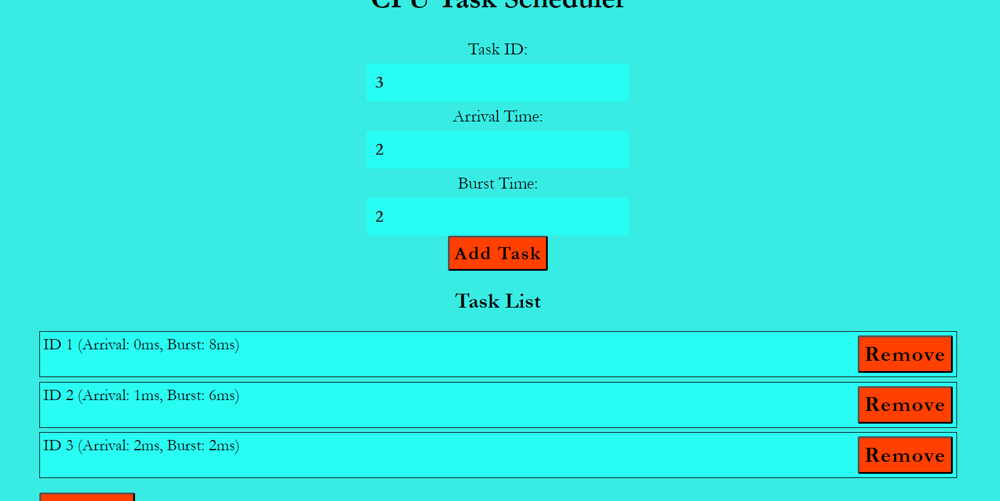
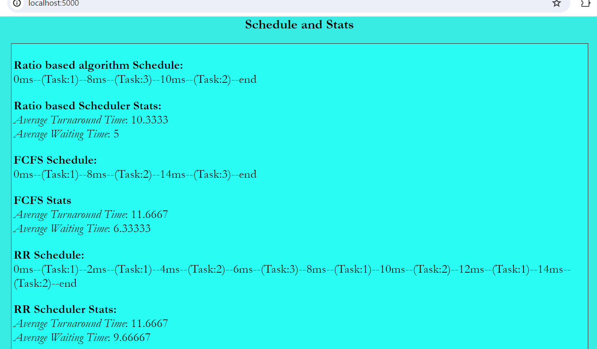

# Task Scheduler
Hello there! This repository is for my self project in which I implemented and analysed Task-Scheduler algorithms
## Project Description
This project implements a Task Scheduler that allows users to input task details through a webpage, schedules the tasks, and displays the scheduling statistics.
A new algorithm named Ratio based scheduling algorithm is discussed.
The webpage also shows statistics for other scheduling algorithms like First-Come-First-Serve (FCFS), Round Robin (RR) and Shortest Job Next (SJN). The backend of the project is implemented using Node.js, and it runs on port 5000. The task scheduler logic is written in C++.

## How to Run the Project
- ## Project directory structure
  - proj_dir/
    - server.js
    - TaskScheduler.cpp
    - scheduler (created after compilation)
    - public/
        - index.html
        - styles.css
        - scripts.js
- ## Dependencies
  - Node.js v20.14.0 ([download](https://nodejs.org/en))
  - framework: Express v4.19.2
    ```console
    npm install express
    ```
    This will add Express to node_modules and updates package.json and package-lock.json
  - g++ (GNU Compiler Collection)
- ## Steps to Execute the Code
  ### 1. Compile the C++ Code:
  Open a terminal and navigate to the project directory (**proj_dir**). Run the following command to compile the **TaskScheduler.cpp** file:
  ```console
  g++ TaskScheduler.cpp -o scheduler
  ```
  This command creates an executable file named **scheduler.exe** in the **proj_dir**.

  ### 2. Run the Node.js Server:
  With the terminal still in the project directory, run the following command to start the "Node.js" server:
  ```console
  node server.js
  ```
  The server will start and listen on port-5000.

  ### 3. Access the Frontend:
  Open a web browser and navigate to
  ```arduino
  localhost:5000
  ```
  This will load the frontend interface where you can input task details and view scheduling statistics. 


## Working of the Project

  ### Task Input and Scheduling:
  User creates a list of tasks by inputing task details such as task id, arrival time, and burst time through the webpage. These details are sent to the Node.js server, which then uses the compiled C++ executable (scheduler) to perform the scheduling.

  ### Scheduling Algorithms Implemented:
  - **Ratio-Based Scheduling** (ratio_based_schedule): Prioritizes tasks based on the ratio of remaining burst time to waiting time.
  - **Shortest Job First** (sjf_schedule): Schedules tasks based on the shortest burst time.
  - **First-Come, First-Served** (fcfs_schedule): Schedules tasks in the order of their arrival.
  - **Round-Robin** (rr_schedule): Implements round-robin scheduling with a fixed time quantum.
  ### Displaying Statistics:
  The results of the scheduling (including task order, start and finish times) and comparative statistics for FCFS, RR and SJN algorithms are displayed on the webpage.

  ### Execution Flow
  - Users input task details in the form on index.html.
  - The input data is sent to the backend using JavaScript.
  - The Node.js server (server.js) receives the input data and writes it to a file.
  - The server then executes the scheduler executable, passing the input data file (**input.txt**) as an argument.
  - The C++ program reads the input, performs the scheduling, and writes the results to std::out.
  - The Node.js server captures the outputs and sends the results back to the frontend.
  - The frontend receives the scheduling results and displays them, along with comparative statistics.

### Explanation of Ratio based Scheduler Algorithm
The ratio-based scheduling algorithm aims to prioritize tasks based on a ratio calculated dynamically during execution. This ratio considers both the remaining burst time of a task and its waiting time (time spent waiting to be executed).
### Learning Takeaways
From this project, I learned:
  - How to integrate C++ code with a Node.js backend.
  - The implementation of a new algorithm.
  - Comparison of custom algoritm with different CPU scheduling algorithms.
  - The process of executing C++ programs from within a Node.js application.
  - This project provided a comprehensive understanding of both backend and frontend development, as well as insights into CPU scheduling algorithms.
### Resources
  - [Youtube playlist](https://www.youtube.com/playlist?list=PLBlnK6fEyqRitWSE_AyyySWfhRgyA-rHk)
  - https://www.geeksforgeeks.org/program-for-shortest-job-first-or-sjf-cpu-scheduling-set-1-non-preemptive/
  - https://www.w3schools.com/nodejs/
